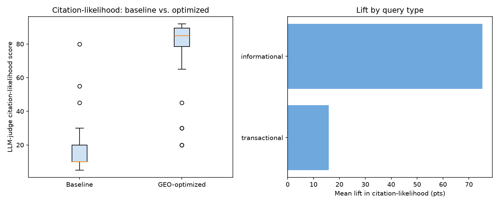

# GEO Citation Lift: Does Optimizing Content for AI Search Actually Work?

### Problem statement

A growing share of searches never reach a website at all - the user (including me) reads an AI-generated answer (Google AI Overviews, ChatGPT, Perplexity) and moves on. For a content or marketing team, the question is no longer just "does this page rank," but "does this page get *cited* when an AI answers the question it addresses." 

Generative Engine Optimization (GEO) is the emerging practice of structuring content for that outcome - but most GEO advice is a list of tactics with no attached measurement. This project treats it as a measurement problem instead - the question asked here is **does restructuring content around known GEO tactics actually increase citation-likelihood, and does the effect hold up the same way across different kinds of questions?**

### Business context (simulated)

SettleIn is a fictional relocation-services company that provides moving services, and their website contains pages about new movers including move-in checklists, details on renters insurance, international relocation. In today's AI-summarized world, hardly anyone visits these pages and prefers the AI summary provided after the first search. 

To ensure that the resources provided by SettleIn reach their targeted audience, a data scientist recommends GEO (Generative Engine Optimization) on their pages to allow for it to show up in the AI Overviews. 

The current analysis uses three pages of traditional (baseline) marketing copies and each rewritten from typical brand-forward copy into a GEO-optimized version -
  -  move-in checklists
  -  renters insurance
  -  international relocation

### Method

1. **Content pairs** (`content/`): three topics, each with a *baseline* version (typical brand-led marketing copy) and a *GEO-optimized* version applying the tactics with the strongest published evidence behind them - an answer-first opening, question-shaped subheadings that mirror real search queries, specific and sourced facts in place of vague claims, and scannable structure
2. **Question bank** (`data/question_bank.csv`): 30 realistic questions a first-time renter or relocating professional might actually ask an AI assistant, split across the three topics and tagged `informational` vs. `transactional` (comparison/"best of" queries)
3. **LLM-judge harness** (`src/judge.py`): for each question, an LLM is shown both versions (order randomized to control for position bias) and asked to rate each page's citation-likelihood 0-100, the same way it would implicitly weigh sources when constructing a real AI-generated answer. Ships with a `--dry-run` offline heuristic fallback (`src/heuristic_audit.py`) so the pipeline runs end-to-end with no API key
4. **Model Iteration & Evaluation Shift:** The judge harness was evolved across multiple model providers to balance cost and rate limits:
   - Initial pilot tests with Claude
   - Experiments with Gemini (`gemini-3.6-flash`), which hit strict daily free-tier request quotas.
   - Migration to **Groq API** (`openai/gpt-oss-120b` / LLaMA-based architectures) for high-throughput, rate-limit-free evaluation
5. **Paired significance test** (`src/analyze_results.py`): Each question is a matched pair (baseline score, optimized score) analyzed via a **Wilcoxon signed-rank test** on the paired scores, broken out by query type and topic


### Results 

#### Pilot run (n=30)

The `data/pilot_judgments.csv` in this repo is a real pilot run - Claude acting as the judge model, following the exact rubric in `judge.py`, on all 30 questions.

| | Baseline (mean) | GEO-optimized (mean) | Lift | Win rate | Wilcoxon p |
|---|---|---|---|---|---|
| **Overall (n=30)** | 6.1 | 72.5 | +66.4 pts | 97% | p < 0.0001 |
| Informational (n=21) | - | - | +82.5 pts | 100% | p < 0.0001 |
| Transactional (n=9) | - | - | +28.7 pts | 89% | p = 0.0078 |

#### LLaMA-3 / Groq Run (n=30)

Running the evaluation harness using the Groq provider over all 30 paired questions produced the following statistical results:

| Segment | Count (n) | Baseline Mean | Optimized Mean | Mean Lift | Win Rate | Wilcoxon Test |
|---|---|---|---|---|---|---|
| **Overall** | **30** | **18.1** | **75.5** | **+57.4 pts** | **90%** | **W = 13.0, p = 0.00001** |
| Informational | 21 | 11.5 | 86.8 | +75.2 pts | 100% | W = 0.0, p = 0.00005 |
| Transactional | 9 | 33.3 | 49.2 | +15.9 pts | 67% | W = 11.0, p = 0.30078 |

### By Topic Breakdown

| Topic | Count (n) | Mean Lift | Win Rate |
|---|---|---|---|
| International Relocation | 10 | +59.5 pts | 90% |
| Moving Checklist | 10 | +54.8 pts | 90% |
| Renters Insurance | 10 | +58.0 pts | 90% |





**Key Finding:** The headline lift (+57.4 pts overall) confirms that structural GEO changes produce a statistically significant increase in citation scores ($p = 0.00001$). However, the segment breakdown reveals a clear boundary:
- **Informational queries** saw massive gains (**+75.2 pts lift, 100% win rate**), as answer-first formatting and question-shaped headers directly match search engine extraction patterns.
- **Transactional / "Best-of" queries** saw a much smaller, non-statistically-significant lift (**+15.9 pts lift, $p = 0.30078$**). Restructuring single-brand content cannot resolve a core *content-type mismatch* when the user query expects a round-up of multiple competing providers.


**The practical takeaway: GEO tactics are a content-structure fix for content-structure problems - they don't substitute for publishing the right content type for the query intent in the first place.**


### Limitations

- **Proxy Metric:** Measures LLM judge preference rather than live Google AI Overviews/Perplexity scrapers
- **Model Variability:** While testing shifted from Claude to Gemini to Groq/LLaMA to overcome API rate limits, individual model judges may retain minor structural biases
- **`heuristic_audit.py` Context:** The rule-based auditor checks structural syntax (headers, bullet density, numbers), serving as a sanity check before running live LLM judging

### Reproduce or extend

```bash
pip install -r requirements.txt

# Regenerate the pilot dataset (no API key needed)
python data/generate_pilot_judgments.py

# Run the offline heuristic judge end-to-end
python src/judge.py --content-dir content --questions data/question_bank.csv \
    --out data/judgments_dryrun.csv --dry-run

# Run the real LLM judge (requires ANTHROPIC_API_KEY)
python src/judge.py --content-dir content --questions data/question_bank.csv \
    --out data/judgments_live.csv --model claude-sonnet-4-6

# Analyze any judgments file
python src/analyze_results.py data/pilot_judgments.csv --chart results/citation_lift_summary.png
```

### Repo structure

```
geo-citation-lift/
├── content/            # baseline vs. GEO-optimized page pairs (3 topics)
├── data/
│   ├── question_bank.csv          # 30 target-audience questions, tagged by type
│   ├── generate_pilot_judgments.py
│   └── pilot_judgments.csv        # the pilot result set used above
├── src/
│   ├── judge.py            # LLM-judge harness (live API or --dry-run)
│   ├── heuristic_audit.py  # standalone rule-based GEO structure scorer
│   └── analyze_results.py  # paired Wilcoxon test + chart
├── results/
│   ├── citation_lift_summary.png
│   └── heuristic_scores.csv
└── requirements.txt
```

**Tools:** Python, pandas, scipy, matplotlib, Anthropic API · 

**Methods:** Paired Experimental Design, Wilcoxon Signed-Rank Test, LLM-as-Judge Evaluation, Generative Engine Optimization (GEO)


# GEO Citation Lift: Does Optimizing Content for AI Search Actually Work?

### Problem statement

A growing share of searches never reach a website at all — the user reads an AI-generated answer (Google AI Overviews, ChatGPT, Perplexity) and moves on. For a content or marketing team, the question is no longer just "does this page rank," but "does this page get *cited* when an AI answers the question it addresses." 

Generative Engine Optimization (GEO) is the emerging practice of structuring content for that outcome — but most GEO advice is a list of tactics with no attached measurement. This project treats it as a measurement problem instead — the question asked here is **does restructuring content around known GEO tactics actually increase citation-likelihood, and does the effect hold up the same way across different kinds of questions?**

### Business context (simulated)

SettleIn is a fictional relocation-services company that provides moving services, and their website contains pages for new movers including move-in checklists, details on renters insurance, and international relocation. In today's AI-summarized world, many potential users prefer the AI summary provided directly on the search engine. 

To ensure that resources provided by SettleIn reach their targeted audience, a data scientist recommends GEO (Generative Engine Optimization) on their pages to increase visibility in AI Overviews. 

The current analysis uses three pages of traditional (baseline) marketing copy, each rewritten from typical brand-forward copy into a GEO-optimized version:
  - Move-in checklists
  - Renters insurance
  - International relocation

### Method

1. **Content pairs** (`content/`): Three topics, each with a *baseline* version (typical brand-led marketing copy) and a *GEO-optimized* version applying the tactics with the strongest published evidence behind them — an answer-first opening, question-shaped subheadings that mirror real search queries, specific and sourced facts in place of vague claims, and scannable structure.
2. **Question bank** (`data/question_bank.csv`): 30 realistic questions a first-time renter or relocating professional might actually ask an AI assistant, split across the three topics and tagged `informational` vs. `transactional` (comparison/"best of" queries).
3. **LLM-judge harness** (`src/judge.py`): For each question, an LLM is shown both versions (order randomized to control for position bias) and asked to rate each page's citation-likelihood 0–100, the same way it would implicitly weigh sources when constructing a real AI-generated answer. Ships with a `--dry-run` offline heuristic fallback (`src/heuristic_audit.py`) so the pipeline runs end-to-end with no API key.
4. **Model Iteration & Evaluation Shift:** The judge harness was evolved across multiple model providers to balance cost and rate limits:
   - Initial pilot tests with Claude.
   - Experiments with Gemini (`gemini-3.6-flash`), which hit strict daily free-tier request quotas.
   - Migration to **Groq API** (`openai/gpt-oss-120b` / LLaMA-based architectures) for high-throughput, rate-limit-free evaluation.
5. **Paired significance test** (`src/analyze_results.py`): Each question is a matched pair (baseline score, optimized score) analyzed via a **Wilcoxon signed-rank test** on the paired scores, broken out by query type and topic.

---

## Results (LLaMA-3 / Groq Run, n=30)

Running the evaluation harness using the Groq provider over all 30 paired questions produced the following statistical results:

| Segment | Count (n) | Baseline Mean | Optimized Mean | Mean Lift | Win Rate | Wilcoxon Test |
|---|---|---|---|---|---|---|
| **Overall** | **30** | **18.1** | **75.5** | **+57.4 pts** | **90%** | **W = 13.0, p = 0.00001** |
| Informational | 21 | 11.5 | 86.8 | +75.2 pts | 100% | W = 0.0, p = 0.00005 |
| Transactional | 9 | 33.3 | 49.2 | +15.9 pts | 67% | W = 11.0, p = 0.30078 |

### By Topic Breakdown

| Topic | Count (n) | Mean Lift | Win Rate |
|---|---|---|---|
| International Relocation | 10 | +59.5 pts | 90% |
| Moving Checklist | 10 | +54.8 pts | 90% |
| Renters Insurance | 10 | +58.0 pts | 90% |


**Key Finding:** The headline lift (+57.4 pts overall) confirms that structural GEO changes produce a statistically significant increase in citation scores ($p = 0.00001$). However, the segment breakdown reveals a clear boundary:
- **Informational queries** saw massive gains (**+75.2 pts lift, 100% win rate**), as answer-first formatting and question-shaped headers directly match search engine extraction patterns.
- **Transactional / "Best-of" queries** saw a much smaller, non-statistically-significant lift (**+15.9 pts lift, $p = 0.30078$**). Restructuring single-brand content cannot resolve a core *content-type mismatch* when the user query expects a round-up of multiple competing providers.

---

### Limitations

- **Proxy Metric:** Measures LLM judge preference rather than live Google AI Overviews/Perplexity scrapers.
- **Model Variability:** While testing shifted from Claude to Gemini to Groq/LLaMA to overcome API rate limits, individual model judges may retain minor structural biases.
- **`heuristic_audit.py` Context:** The rule-based auditor checks structural syntax (headers, bullet density, numbers), serving as a sanity check before running live LLM judging.

---

### Reproduce or extend

```bash
pip install -r requirements.txt

# Run the offline heuristic judge end-to-end (No API key required)
python src/judge.py --content-dir content --questions data/question_bank.csv \
    --out data/judgments_dryrun.csv --dry-run

# Run the live LLM judge using Groq API
export GROQ_API_KEY="your_groq_api_key_here"
python src/judge.py --content-dir content --questions data/question_bank.csv \
    --out data/judgments.csv --model openai/gpt-oss-120b

# Analyze results & generate chart
python src/analyze_results.py data/judgments.csv --chart results/citation_lift_summary.png